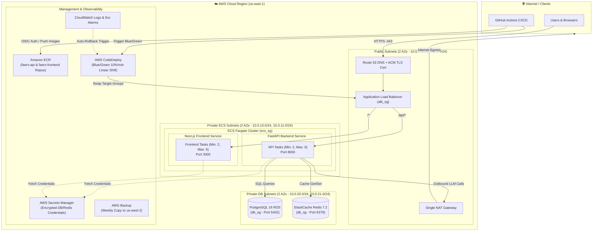
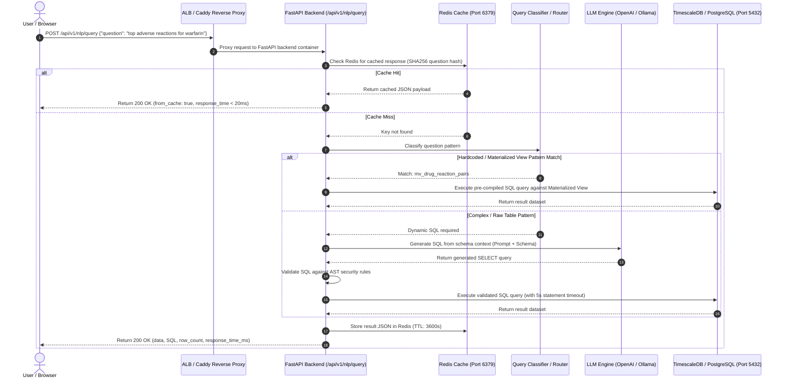
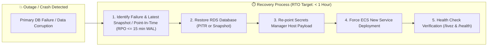

# FAERS Analytics Platform — Architecture & Dataflow Diagrams

This document provides visual architecture and dataflow diagrams for team reviews, client meetings, and system documentation. The Mermaid code blocks below can be pasted directly into [Draw.io](https://app.diagrams.net/) (via `Insert → Advanced → Mermaid`) or viewed on GitHub.

---

## 1. System Deployment Architecture (AWS ECS Fargate & Network Security)

---

## 2. Natural Language Query Dataflow Diagram

---

## 3. Disaster Recovery (DR) & RTO / RPO Flow

---

## Summary Checklist of Required Features

| Requirement | Implementation Status | Location in Codebase |
| :--- | :--- | :--- |
| **SSL Certificate** | ✅ Fulfilled | [Caddyfile](../Caddyfile) (Auto Let's Encrypt) & [acm.tf](../terraform/acm.tf) |
| **HTTPS** | ✅ Fulfilled | `Caddyfile` (HTTP 80 → 443) & [alb.tf](../terraform/alb.tf) (301 Redirect) |
| **GitHub Actions** | ✅ Fulfilled | [.github/workflows/ci.yml](../.github/workflows/ci.yml) & [deploy.yml](../.github/workflows/deploy.yml) |
| **Terraform** | ✅ Fulfilled | Entire [terraform/](../terraform/) directory (14 `.tf` configuration files) |
| **ECS / EKS** | ✅ Fulfilled | [ecs.tf](../terraform/ecs.tf) (Fargate Cluster, Task Definitions, Services) |
| **Subnets** | ✅ Fulfilled | [network.tf](../terraform/network.tf) (6 subnets across 2 Availability Zones) |
| **VPC & Security** | ✅ Fulfilled | `network.tf` (VPC, IGW, NAT, 3-tier Security Groups `alb_sg`, `ecs_sg`, `db_sg`) |
| **Blue/Green Deployment** | ✅ Fulfilled | [codedeploy.tf](../terraform/codedeploy.tf) & `deploy.yml` (CodeDeploy 10%/min linear shift) |
| **Disaster Recovery** | ✅ Fulfilled | [docs/disaster-recovery.md](disaster-recovery.md) & [scripts/dr-drill.sh](../scripts/dr-drill.sh) |
| **RTO & RPO** | ✅ Fulfilled | Documented: **RTO = 1 Hour**, **RPO = 15 Minutes** (continuous WAL logs) |
| **Crash RTO/RPO Speed** | ✅ Fulfilled | Automated PITR restore (< 15 min data loss, < 1 hr full service recovery) |
| **Auto Scaling Groups** | ✅ Fulfilled | [autoscaling.tf](../terraform/autoscaling.tf) (ECS Target Tracking 60% CPU & ALB requests) |
| **Dataflow / Architecture Diagrams** | ✅ Fulfilled | Documented in this file (`docs/architecture-diagrams.md`) |
| **ECR & ECS Deployment** | ✅ Fulfilled | [ecr.tf](../terraform/ecr.tf), `ecs.tf`, and `.github/workflows/deploy.yml` |
